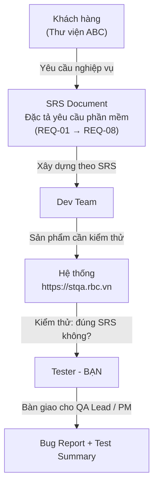

# Đề bài A1 — Kiểm thử thủ công / Assignment A1 — Manual Black-box Testing

**Môn học**: Kiểm thử và Đảm bảo chất lượng phần mềm (STQA)
**Hệ thống**: Quản lý mượn sách Thư viện ABC — https://stqa.rbc.vn
**Phương pháp**: Kiểm thử hộp đen (Black-box Testing)
**Repo starter**: https://github.com/chuyentt/stqa-library-manual-starter

---

## 1. Mục tiêu / Objectives

Sinh viên thực hành kiểm thử phần mềm thủ công dựa trên đặc tả yêu cầu (SRS), áp dụng các kỹ thuật thiết kế kiểm thử, thực thi trên hệ thống thực, và tạo bộ tài liệu kiểm thử hoàn chỉnh. Sau bài tập này, sinh viên có khả năng:

- Đọc SRS và xác định **kết quả mong đợi** (expected result) cho từng yêu cầu
- Áp dụng **3 kỹ thuật thiết kế** kiểm thử: EP, BVA, Decision Table
- Viết **test case** có cấu trúc rõ ràng, dữ liệu cụ thể, có thể tái hiện
- Thực thi test trên hệ thống thật và ghi nhận kết quả **Pass/Fail**
- Viết **bug report** chuyên nghiệp cho mỗi lỗi phát hiện
- Tổng hợp và **đánh giá chất lượng** phần mềm (hoạt động QA)

---

## 2. Bối cảnh / Context

### 2.1. Yêu cầu đến từ đâu?



**Bạn là Tester.** Nhiệm vụ: so sánh **hành vi thực tế** của hệ thống với **kết quả mong đợi** trong SRS. Nếu khác → đó là **bug**.

### 2.2. Kết quả mong đợi (expected result) lấy từ đâu?

Tất cả expected result đều lấy từ **SRS**. Hãy đọc kỹ từng REQ và tìm expected result trong:

| Nguồn trong SRS |
|-------|
| Mục **"Quy tắc"** của mỗi REQ — mô tả hệ thống phải xử lý thế nào |
| Mục **"Thông báo lỗi"** — nội dung thông báo khi input không hợp lệ |
| Mục **"Quyền truy cập"** — ai được làm gì, ai không |
| **Dữ liệu ban đầu** (mục 3 SRS) — kiểm tra hiển thị đúng dữ liệu seed |

---

## 3. Yêu cầu / Requirements

### 3.1. Bắt buộc (Minimum)

| # | Yêu cầu | Ghi chú |
|---|---------|---------|
| 1 | Fork repo starter → tạo repo nhóm | Đặt tên: `stqa-manual-<tên-nhóm>` |
| 2 | Viết ít nhất **20 test case** | Phủ đủ chức năng chính (xem mục 4) |
| 3 | Áp dụng ít nhất **3 kỹ thuật** thiết kế kiểm thử | EP, BVA, Decision Table |
| 4 | Bao gồm **happy path + negative + boundary** | Không chỉ test luồng chính |
| 5 | **Thực thi** tất cả TC trên hệ thống | Ghi nhận Pass/Fail + actual result |
| 6 | Tạo **bug report** cho mỗi TC Fail | Đầy đủ bước tái hiện, severity |
| 7 | Viết **báo cáo tổng hợp** (summary) | Thống kê, đánh giá, đề xuất |
| 8 | Điền thông tin nhóm trong `README.md` | Bảng Team Information |
| 9 | Nộp bài qua **link repo** hoặc **Pull Request** | Theo hướng dẫn giảng viên |

### 3.2. Nâng cao (Bonus — cộng điểm)

| # | Yêu cầu | Điểm cộng |
|---|---------|-----------|
| B1 | Viết **≥ 25 test case** phủ tất cả 8 REQ | +0.5 |
| B2 | Thêm **bảng Decision Table** hoàn chỉnh cho chức năng Mượn sách | +0.5 |
| B3 | Mỗi bug report có **ảnh chụp minh chứng** | +0.5 |
| B4 | Tổng hợp có **đề xuất ưu tiên sửa lỗi** (High trước, Low sau) | +0.5 |

> ⚠️ Điểm cộng tối đa: **+1.5 điểm** (trên thang 10).

---

## 4. Hướng dẫn phân bổ Test Case

- Phủ **tất cả 8 REQ** (REQ-01 → REQ-08) — không bỏ sót chức năng nào.
- Tự phân bổ số lượng TC cho mỗi REQ sao cho **hợp lý** — chức năng phức tạp cần nhiều TC hơn.
- Bao gồm **happy path**, **negative**, và **boundary** cho mỗi chức năng.
- Áp dụng ít nhất **3 kỹ thuật thiết kế** (EP, BVA, Decision Table) — tự xác định kỹ thuật nào phù hợp cho REQ nào.
- Tổng tối thiểu: **20 TC**.

---

## 5. Hướng dẫn thực hiện / Step-by-Step Guide

### Bước 1: Fork & Clone

```bash
# Fork repo starter trên GitHub → repo của nhóm
git clone https://github.com/<your-team>/stqa-manual-<team-name>.git
cd stqa-manual-<team-name>
```

### Bước 2: Đọc SRS + xem ví dụ mẫu

1. Đọc [docs/SRS-library-system.md](../docs/SRS-library-system.md) — hiểu 8 yêu cầu
2. Xem [examples/sample-test-case.md](../examples/sample-test-case.md) — cách viết TC tốt
3. Xem [examples/sample-bug-report.md](../examples/sample-bug-report.md) — cách viết bug report

### Bước 3: Viết test case

Mở [submissions/test-cases.md](../submissions/test-cases.md) và viết test case từ TC-01.

**Mỗi TC cần có:**
- ID rõ ràng (TC-01, TC-02, ...)
- Mapping REQ (REQ-01, REQ-04, ...)
- Mục tiêu kiểm thử
- Tiền điều kiện
- Dữ liệu đầu vào cụ thể
- Bước thực hiện đánh số
- Kết quả mong đợi kiểm chứng được

### Bước 4: Chạy test trên hệ thống

1. Truy cập https://stqa.rbc.vn
2. Chạy từng TC theo bước đã viết
3. Ghi kết quả vào [submissions/test-execution.md](../submissions/test-execution.md)
4. Nếu Fail → ghi rõ actual result

### Bước 5: Viết bug report

Mỗi TC Fail → tạo bug report trong [submissions/bug-reports.md](../submissions/bug-reports.md).

**Mỗi bug cần có:** Bug ID, tiêu đề mô tả hành vi lỗi, bước tái hiện, expected vs actual, tác động, severity, minh chứng (nếu có), đề xuất xử lý.

### Bước 6: Viết tổng hợp

Điền [submissions/summary.md](../submissions/summary.md):
- Thống kê Pass/Fail
- Phân tích theo nhóm chức năng
- Đánh giá chất lượng phần mềm
- Đề xuất ưu tiên sửa lỗi

### Bước 7: Commit & Push

```bash
git add .
git commit -m "test: complete A1 manual testing submission"
git push origin main
```

---

## 6. Rubric chấm điểm / Grading Rubric

| Tiêu chí | Trọng số | Xuất sắc (9–10) | Tốt (7–8) | Đạt (5–6) | Chưa đạt (<5) |
|----------|---------|-----------------|-----------|-----------|---------------|
| **Độ phủ chức năng** | **25%** | ≥ 20 TC phủ 8 REQ, có happy+negative+boundary | 20 TC, 5–7 REQ | 15–19 TC, 3–4 REQ | < 15 TC hoặc < 3 REQ |
| **Kỹ thuật thiết kế** | **25%** | Áp dụng đúng EP + BVA + Decision Table, giải thích tại sao chọn kỹ thuật | 2–3 kỹ thuật, phần lớn đúng | 1 kỹ thuật, áp dụng chưa rõ | Không áp dụng kỹ thuật |
| **Chất lượng mô tả** | **20%** | Bước đánh số rõ, dữ liệu cụ thể, expected result kiểm chứng được | Tốt, 1–2 TC thiếu sót nhỏ | Chung chung, thiếu dữ liệu cụ thể | Không rõ bước, không thể tái hiện |
| **Báo cáo lỗi** | **20%** | Tiêu đề mô tả hành vi, bước tái hiện đủ, severity có giải thích, có minh chứng | Đầy đủ, thiếu minh chứng | Cơ bản, thiếu expected/actual | Không có bug report |
| **Trình bày & format** | **10%** | Đúng template, commit history rõ, Table format sạch | Minor issues | Major issues | Không theo template |

---

## 7. Lưu ý quan trọng / Important Notes

1. **Kết quả mong đợi lấy từ SRS** — không phải từ "cảm tính". Luôn trích dẫn REQ khi viết expected result.
2. **So sánh thực tế với SRS** — nếu hành vi hệ thống khác với SRS, hãy ghi nhận và báo cáo.
3. **Test case Fail = cơ hội** — mỗi Fail là 1 bug tiềm năng cần báo cáo.
4. **Reset dữ liệu** trước mỗi nhóm test: Refresh trang HOẶC Thủ thư nhấn 🔄.
5. **Mỗi thành viên commit ít nhất 1 lần** — thể hiện đóng góp cá nhân.
6. **Viết bằng tiếng Việt** hoàn toàn OK — chỉ cần giữ đúng cấu trúc template.

---

## 8. Nộp bài / Submission

| Mục | Yêu cầu |
|-----|---------|
| **Hình thức** | Link repo GitHub (public hoặc invite giảng viên) |
| **Bắt buộc có** | 4 file trong `submissions/`: test-cases, test-execution, bug-reports, summary |
| **README.md** | Đã điền thông tin nhóm |
| **Tùy chọn** | Ảnh chụp minh chứng (bonus B3) |
| **Hạn nộp** | Theo thông báo của giảng viên |

---

## 9. Khai báo sử dụng AI (Tùy chọn)

> Nếu nhóm có sử dụng công cụ AI (ChatGPT, Copilot, Gemini...) để hỗ trợ viết test case hoặc bug report, hãy ghi rõ trong phần "Khai báo sử dụng AI" ở `submissions/summary.md`. Khai báo trung thực **không ảnh hưởng điểm** — đây là kỹ năng minh bạch trong nghề.
>
> **Lưu ý quan trọng:** Xem [docs/ai-guidelines.md](ai-guidelines.md) để biết cách dùng AI hiệu quả và tránh những cái bẫy phổ biến.
